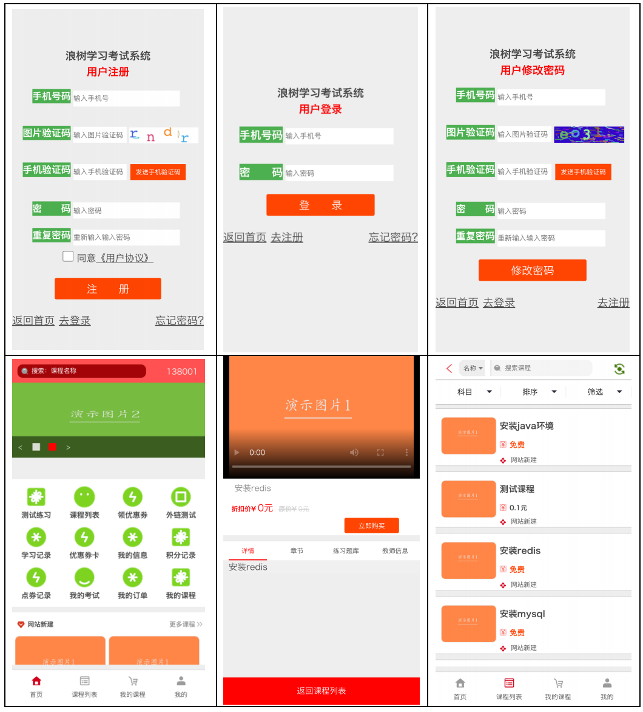
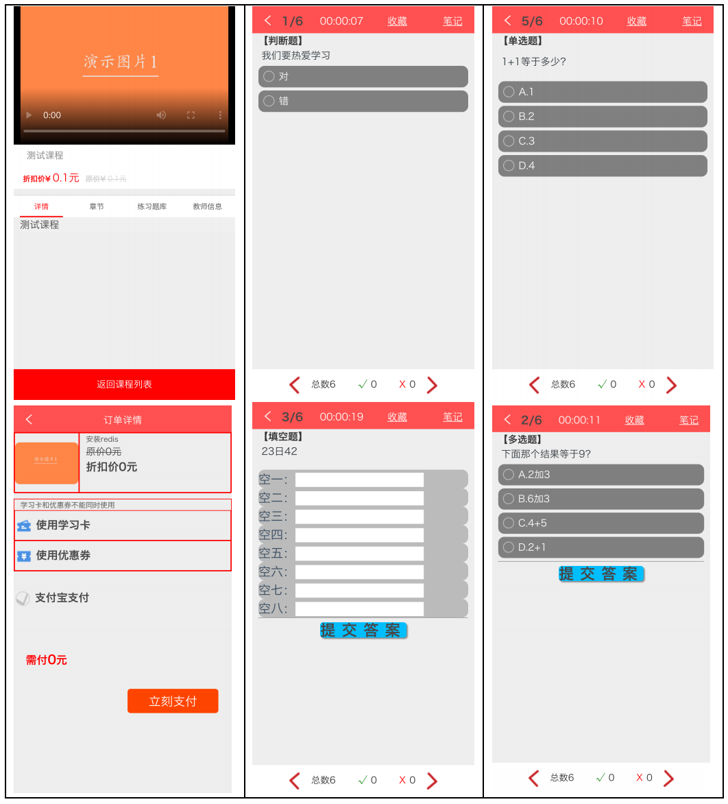
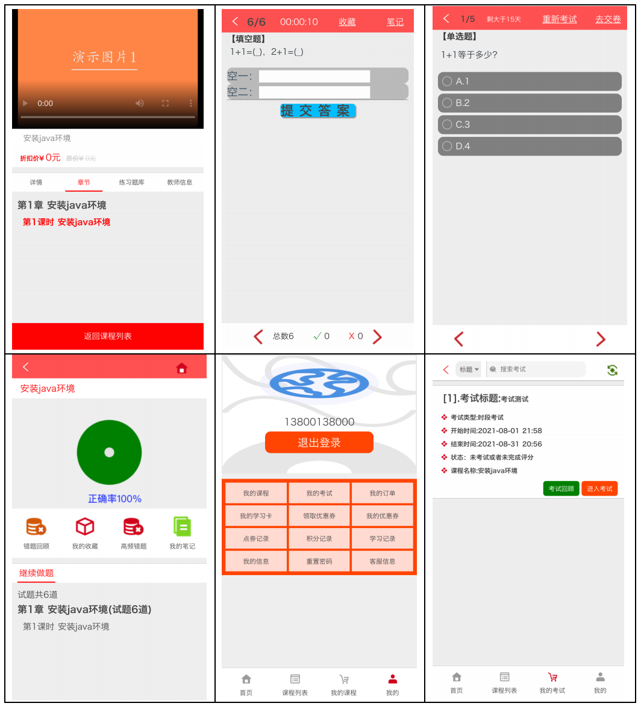
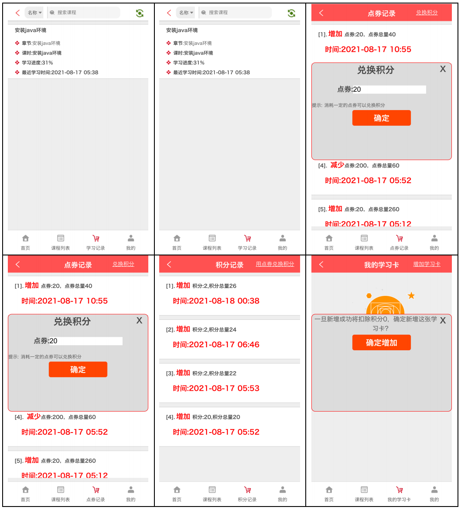
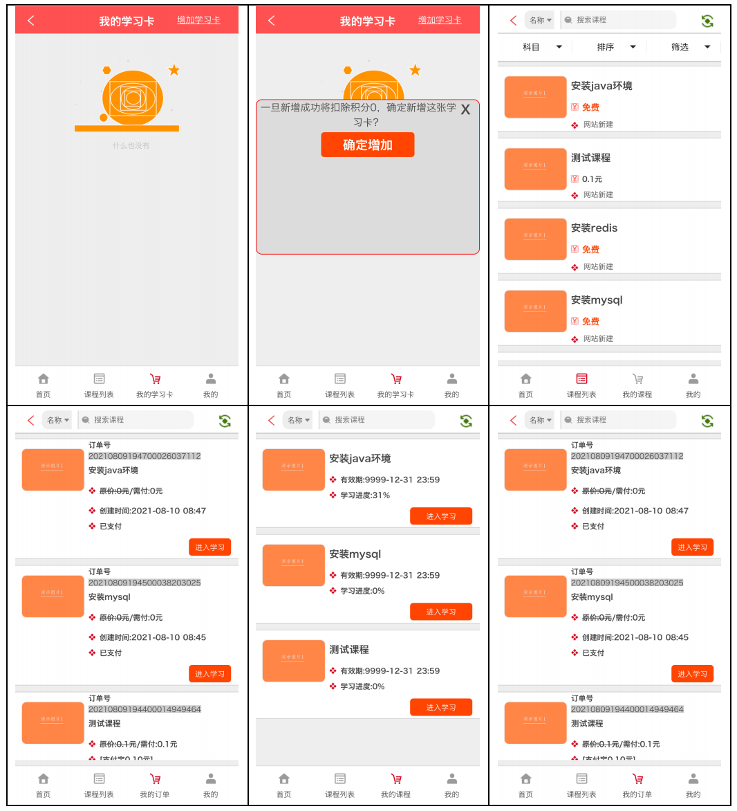
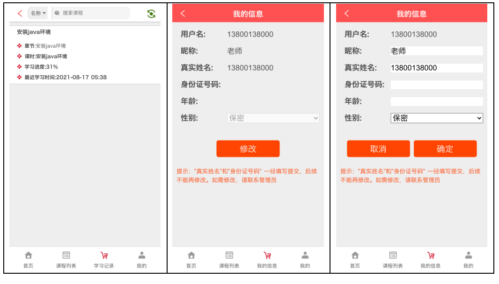

#wangxin-study

# 浪树学习考试系统
#### 浪树学习考试系统（wangxin-education），致力打造一个低成本通用的在线教育系统，让用户直接通过系统可视化配置并尽可能无须修改任何代码即可实现上线商用。系统采用前后端分离模式，前台和移动端采用vue.js为核心框架，后台采用Java语言，框架springboot+spring+mybatis+redis+mysql。系统目前主要功能有课程点播、直播、练习、考试、支付、营销等功能。

## java后端、PC前端(文件夹wangxin-web)、移动端(文件夹wangxin-mobile) 源代码 已开放

## 可以向官方申请获取 免费永久商业授权(无功能性限制) ，使用过程中须遵循协议规定，可以二次开发，但不可二次转售。

## 安装部署教程、使用教程、二次开发教程 持续更新中........

### QQ技术交流群：1054181656
### 联系QQ：1500375268

### 演示地址
#### 前端演示地址：
#### 移动端演示地址：
#### 后台演示地址： 

### PC前台主要功能介绍
##### 首页功能：导航模块，订单模块，广告模块
##### 列表功能：分类模块，课程详情页功能，课程介绍、目录的展示和购买、播放功能等
##### 个人中心：具有个人信息设置、密码修改、订单管理、学习记录、进行考试、学习卡、优惠券等功能
##### 教师中心：课程管理、试题管理、考试管理等

### H5移动端(可以打包小程序、APP端等)功能介绍
##### 首页功能：广告、公告、中部导航、课程专区
##### 列表功能：分类模块，课程详情页功能，课程介绍、目录的展示和购买、播放功能等
##### 试题练习：刷题练习(可以多端刷题记录同步)功能
##### 考试模块：进行考试
##### 个人中心：学习卡、优惠券、订单管理、考试、个人信息设置等等

### 后端控制台主要功能介绍
##### 权限管理：多角色多用户自定义配置
##### 系统配置：站点配置及第三方参数配置
##### 教师管理：教师管理、审核
##### 学生管理：管理学生
##### 课程管理：具有课程审核、发布功能
##### 用户登录：同一时间只允许同一个账号在同一个地方登录，防止账号共享
##### 站点设置：头部、底部、底部二维码、友情链接、移动端中部导航设置等
##### 支付功能：目前集成了支付宝支付
##### 营销管理：学习卡、优惠券等
##### 学习记录：查看学生学习记录

### 工程目录说明：
##### 1、该工程为Maven工程，文件夹wangxin-web为PC端的源代码，文件夹wangxin-mobile为移动端的源代码。
##### 2、项目的版本号在src/main/resources/version文件里面。
##### 3、文件夹sql里面为工程SQL，请对应版本，全量的意思是整个项目的SQL的SQL文件，用于新部署项目或者重新部署项目。增量是本版本基于上个版本的数据库变化，用于升级版本，升级版本是一个非常有风险的操作，升级之前务必备份数据和项目工程，防止升级意外带来不可逆转的麻烦。
##### 4、src/main/resources/static/为前端打包后的文件，web文件夹是管理控制台前端文件，w-web是PC端文件，wxmobile是移动端文件。
##### 5、项目的配置文件为src/main/resources/application.properties

### 工程安装包本地部署
##### 1、安装jdk1.8、mysql、redis,启动mysql和redis
##### 2、去百度网盘下载最新的安装包和SQL文件
链接: https://pan.baidu.com/s/1WDAI95Iq7RUZ7z--tuLo4w  密码: 3bdi
##### 3、导入SQL文件到Mysql
##### 4、启动工程，命令：java -jar jar包名称

### 工程编译启动
##### 1、安装jdk1.8、mysql、redis、eclipse，启动mysql和redis
##### 2、clone项目下来
##### 3、用eclipse导入项目
##### 4、运行com.wangxin.langshu.ApiApplication，启动

### 终端页面访问
##### 1、管理控制台：http://127.0.0.1:8080/web/index.html  用户名/密码：13800138000/13800138000 ，可以配置一些需要的，比如阿里云短信模版等。
##### 2、PC端：http://127.0.0.1:8080/w-web/index.html    用户名/密码：13800138000/13800138000 ，上面管理控制台可以设置登录用户名和密码，也可以注册后登录。
##### 3、移动端：http://127.0.0.1:8080/wxmobile/index.html   用户名/密码：13800138000/13800138000，上面管理控制台可以设置登录用户名和密码，也可以注册后登录。

### 移动端截图：

### QQ技术交流群：1054181656
### 联系QQ：1500375268
